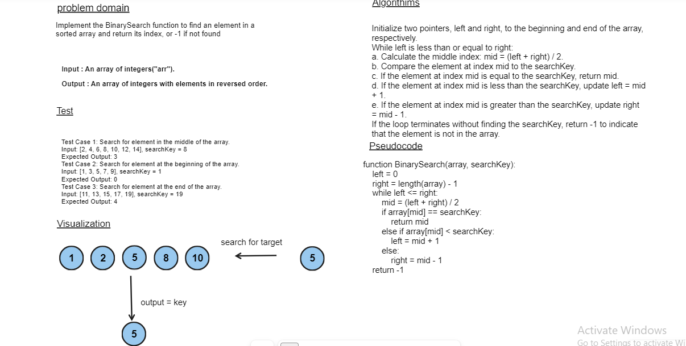

# data-structures-and-algorithms

## Binary Search
Write a function called BinarySearch which takes in 2 parameters: a sorted array and the search key. Without utilizing any of the built-in methods available to your language, return the index of the array’s element that is equal to the value of the search key, or -1 if the element is not in the array.
## Whiteboard Process

## Approach & Efficiency
1. the function takes a sorted array and the key which represent the index i want.
2. the search operation will be as dividing the array along ( start , mid , end). 
    - check if the target [key > mid] or [key < mid] or [key = target] to decide the senario.
    - according to this check the iteration to find the target will be from different indexes of array.
3. Return the index target
4. The Effeciency for compiler work will be increased due to O(1) comparison 

## Example:
Input: [2, 3, 5, 6 , 7 , 10] , 5

Output: 5 -> target.
