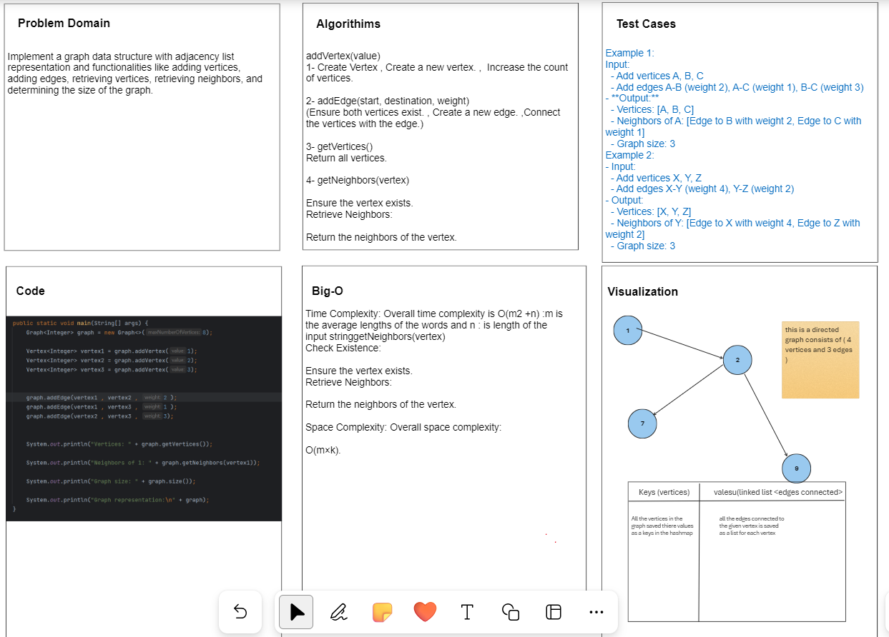

# Graph Implementation Lab

## Challenge Title
Implement a graph data structure with adjacency list representation and various functionalities.

## Whiteboard Process
<!-- Embedded whiteboard image -->


## Approach & Efficiency
For the implementation, we used an adjacency list to represent the graph. The approach involved creating classes for `Vertex`, `Edge`, and `Graph`, where vertices are stored in a `HashMap`, and each vertex has a list of edges representing its neighbors.

### Big O Analysis
- **Time Complexity:** The time complexity for adding a vertex or edge is O(1) since we are using a HashMap. Retrieving neighbors or vertices is O(V + E), where V is the number of vertices, and E is the number of edges.
- **Space Complexity:** The space complexity is O(V + E), where V is the number of vertices, and E is the number of edges.

## Solution
To run the code, you can follow these steps:

1. Clone the repository:
   ```bash
   git clone https://github.com/your_username/graph-implementation.git
   run the main method with following code .
   
### Input: 


