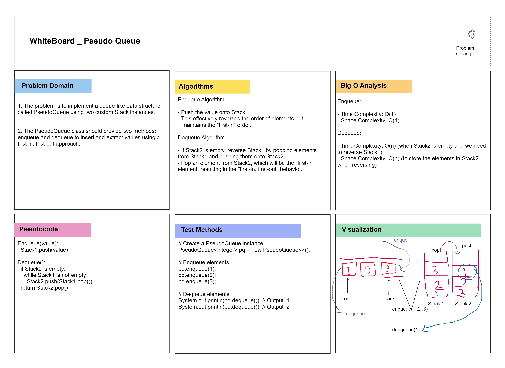

# PseudoQueue Challenge (Java)

## Description
This challenge involves implementing a queue-like data structure called `PseudoQueue` using two custom `Stack` instances in Java. The `PseudoQueue` class provides two methods: `enqueue` and `dequeue`, which allow you to insert and extract values using a first-in, first-out approach.

## Whiteboard Process


## Approach & Efficiency
- For the `enqueue` method, we use `Stack1` to push elements onto it, effectively reversing their order but maintaining the "first-in" order.
- For the `dequeue` method, we use `Stack2` to pop elements from it, which, when reversed, results in the "first-in, first-out" behavior.
- Time complexity:
    - Enqueue: O(1) - Pushing an element onto a stack is a constant-time operation.
    - Dequeue: O(n) - When `Stack2` is empty, we need to reverse `Stack1`, which takes O(n) time, where n is the number of elements in `Stack1`.
- Space complexity: O(n) - We are using two stacks to store the elements.

## Solution
To run the code and see examples in action, create a `PseudoQueue` instance, enqueue elements, and dequeue elements:

```java
// Create a PseudoQueue instance
PseudoQueue<Integer> pq = new PseudoQueue<>();

// Enqueue elements
pq.enqueue(1);
pq.enqueue(2);
pq.enqueue(3);

// Dequeue elements
System.out.println(pq.dequeue()); // Output: 1
System.out.println(pq.dequeue()); // Output: 2
