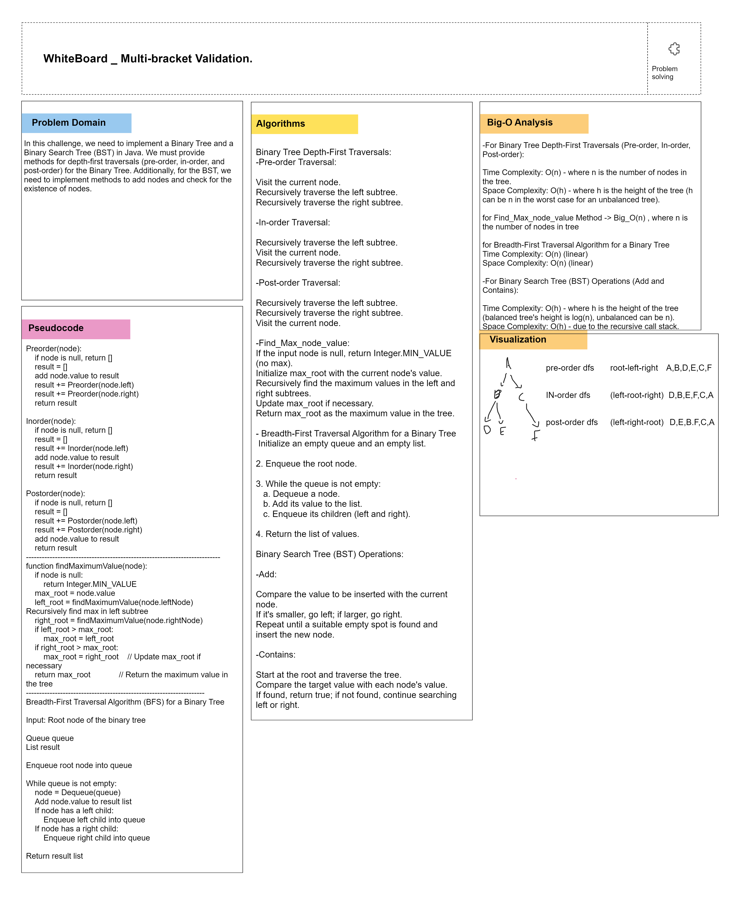

# Binary Tree and Binary Search Tree

## Description
This challenge involves creating classes for a binary tree and a binary search tree and implementing various methods to perform depth-first traversals, insertion of nodes, checking for the existence of nodes, breadth-first traversal. then we extend the classes to handle K-ary tree for applying fizzBUZZ approach.

## Whiteboard Process


## Approach & Efficiency
For the Binary Tree:
- We instantiated a Binary Tree class with a root node.
- Depth-first traversals (pre-order, in-order, and post-order) were implemented recursively.
- We extended the binary tree class to create a k-ary tree class, implementing the necessary methods to work with a k-ary structure.
- The FizzBuzz transformation was applied to the nodes of the k-ary tree, replacing node values with "Fizz," "Buzz," "FizzBuzz," or integers based on divisibility criteria.

For the Binary Search Tree (BST):
- We extended the Binary Tree class to create a Binary Search Tree class.
- The "add" method was implemented to insert nodes at the correct location in the tree.
- The "contains" method was implemented to check if a value exists in the tree.

### Big O Analysis
- Time Complexity: The time complexity for the depth-first traversal methods is O(n), where n is the number of nodes in the tree. The "add" and "contains" methods in the BST have a time complexity of O(h), where h is the height of the tree.
- Space Complexity: The space complexity for the depth-first traversal methods is O(h) due to the recursion stack. The "add" and "contains" methods have a space complexity of O(1) since they use only a few additional variables.
- The time complexity for applying the FizzBuzz transformation to a k-ary tree is O(n), where n is the number of nodes in the tree. This operation traverses each node once.
- The space complexity is O(h) due to the recursion stack used during traversal, where h is the height of the k-ary tree.

## Methods

### Binary Tree Methods
- `preorderTraversal`: Perform a pre-order depth-first traversal of the binary tree.
- `inorderTraversal`: Perform an in-order depth-first traversal of the binary tree.
- `postorderTraversal`: Perform a post-order depth-first traversal of the binary tree.
- `breadthFirst`: Perform a breadth-first traversal of the binary tree.
- `findMaxValue`: Find the maximum value node in the binary tree.
- `fizzBuzzTree`: Apply the FizzBuzz transformation to the k-ary tree, creating a new tree with modified values.


### Binary Search Tree (BST) Methods
- `add`: Insert a node with a given value into the BST.
- `contains`: Check if a given value exists in the BST.

## Usage
To use these classes and methods, follow these steps:

### Binary Tree
```java
BinaryTree binaryTree = new BinaryTree(rootValue);
// Add nodes to the tree as needed
List<Integer> preorderTraversal = binaryTree.preorderTraversal();
List<Integer> inorderTraversal = binaryTree.inorderTraversal();
List<Integer> postorderTraversal = binaryTree.postorderTraversal();
List<Integer> breadthFirstTraversal = binaryTree.breadthFirst();
int maxNodeValue = binaryTree.findMaxValue(binaryTree.root);
KaryTreeNode root = new KaryTreeNode("15"); // Create a k-ary tree
// Add child nodes as needed

KaryTreeNode newRoot = FizzBuzzTree.fizzBuzzTree(root);
