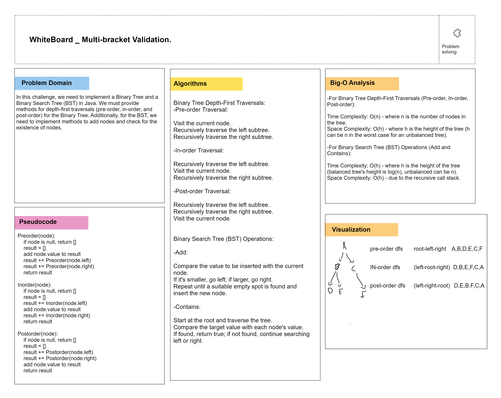

# Binary Tree and Binary Search Tree

## Description
This challenge involves creating classes for a binary tree and a binary search tree and implementing various methods to perform depth-first traversals, insertion of nodes, and checking for the existence of nodes.

## Whiteboard Process


## Approach & Efficiency
For the Binary Tree:
- We instantiated a Binary Tree class with a root node.
- Depth-first traversals (pre-order, in-order, and post-order) were implemented recursively.

For the Binary Search Tree (BST):
- We extended the Binary Tree class to create a Binary Search Tree class.
- The "add" method was implemented to insert nodes at the correct location in the tree.
- The "contains" method was implemented to check if a value exists in the tree.

### Big O Analysis
- Time Complexity: The time complexity for the depth-first traversal methods is O(n), where n is the number of nodes in the tree. The "add" and "contains" methods in the BST have a time complexity of O(h), where h is the height of the tree.
- Space Complexity: The space complexity for the depth-first traversal methods is O(h) due to the recursion stack. The "add" and "contains" methods have a space complexity of O(1) since they use only a few additional variables.

## Solution
To use these classes and methods, follow these steps:

### Binary Tree
```java
BinaryTree binaryTree = new BinaryTree(rootValue);
// Add nodes to the tree as needed
List<Integer> preorderTraversal = binaryTree.preorderTraversal();
List<Integer> inorderTraversal = binaryTree.inorderTraversal();
List<Integer> postorderTraversal = binaryTree.postorderTraversal();

BinarySearchTree binarySearchTree = new BinarySearchTree(rootValue);
binarySearchTree.add(value);
boolean exists = binarySearchTree.contains(value);

