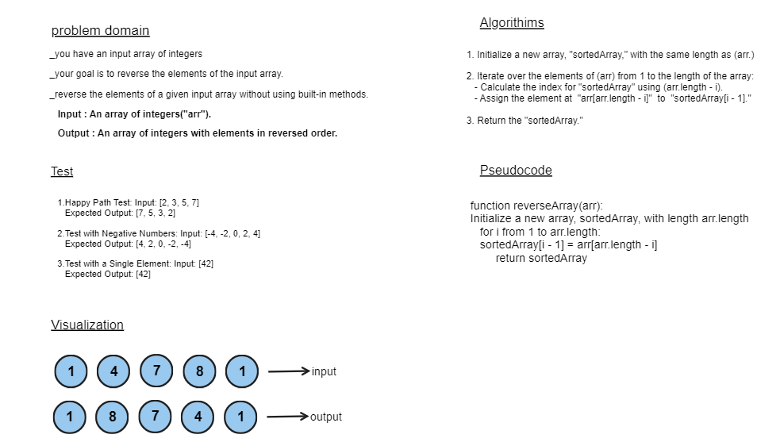

# data-structures-and-algorithms

## Array_Reversal
Write a function called reverseArray which takes an array as an argument. Without utilizing any of the built-in methods available to your language, return an array with elements in reversed order.

## Whiteboard Process

## Approach & Efficiency
1. Initialize a new array, "sortedArray," with the same length as "arr."
2. Iterate over the indices of "arr" from 1 to the length of the array:
   - Calculate the index for "sortedArray" using (arr.length - i).
   - Assign the element at "arr[arr.length - i]" to "sortedArray[i - 1]."
3. Return the "sortedArray."

## Example:
Input: [2, 3, 5, 7]

Output: [7, 5, 3, 2]
